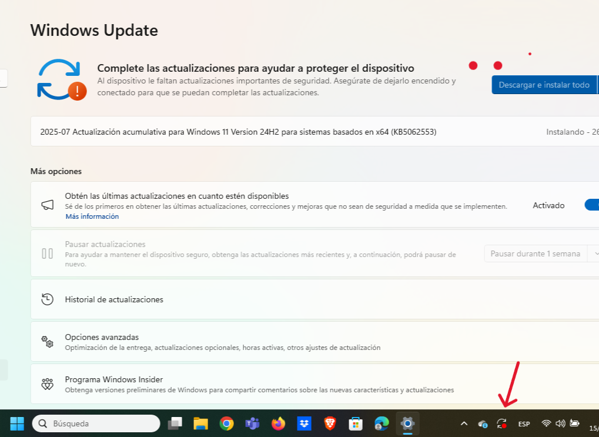
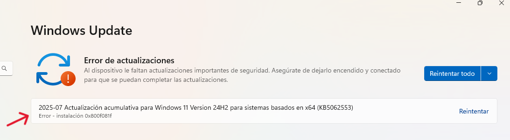
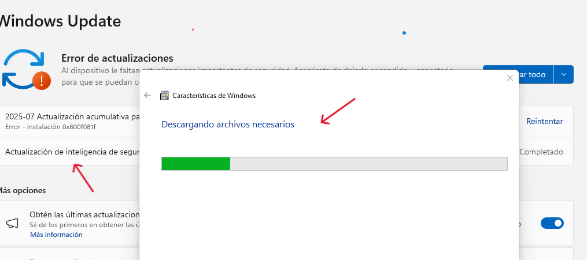
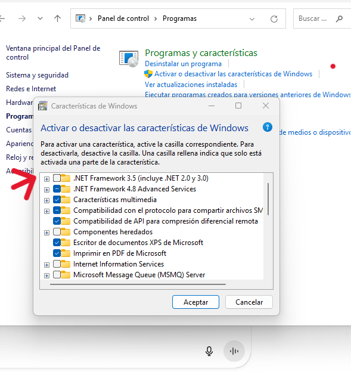
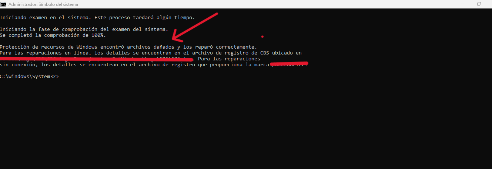
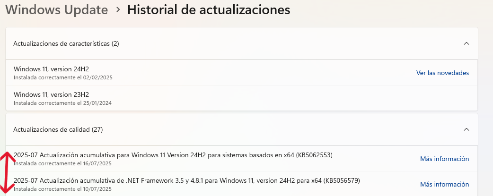
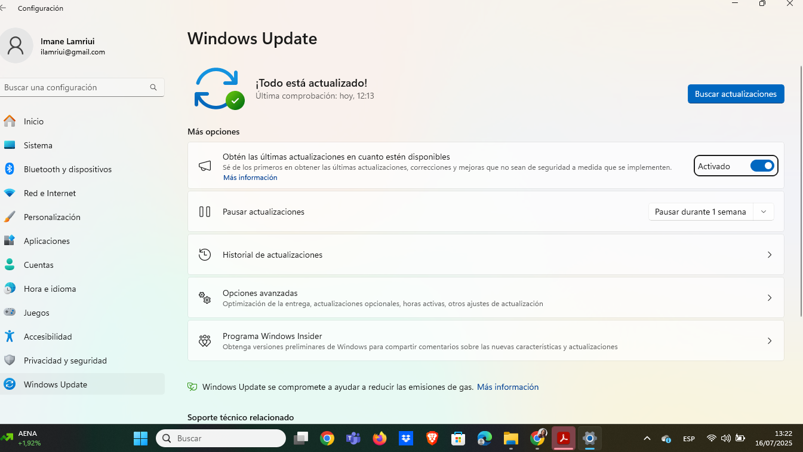

# Error-0x800F081F-en-Windows-11

Este error se dio justo al instalar:

- **KB5062553** – Actualización acumulativa de seguridad y calidad para Windows 11 24H2
- **KB5066579** – Actualización acumulativa de .NET Framework 3.5 y 4.8.1

---

## Paso 1 – Activar manualmente .NET Framework 3.5

Como parte de la investigación, identifiqué que este error muchas veces ocurre porque el sistema no encuentra los archivos necesarios para .NET Framework.

➡Abrí:  
`Panel de control > Programas > Activar o desactivar características de Windows`

 Activé manualmente:  
- `.NET Framework 3.5 (incluye .NET 2.0 y 3.0)`

Windows intentó descargar e instalar los archivos…  
pero tras reiniciar, el error persistía.

---

## Paso 2 – Esperar y volver a intentar (proceso en segundo plano)

En vez de forzar la instalación de una ISO o usar DISM directamente:

- Dejé que el sistema trabajara en **segundo plano** tras el reinicio.
- Al día siguiente, volví a abrir Windows Update y **reintenté la instalación**.

Resultado: ¡actualización completada con éxito!

---

## ✅ Actualizaciones que finalmente se instalaron

| Fecha       | Actualización                                                  | Código       |
|-------------|----------------------------------------------------------------|--------------|
| 10/07/2025  | .NET Framework 3.5 y 4.8.1 para Windows 11 24H2 (x64)          | KB5066579    |
| 16/07/2025  | Acumulativa de seguridad y calidad para Windows 11 24H2 (x64) | KB5062553    |

Ver captura en `/capturas/`

---

## Conclusión y buenas prácticas

- Windows puede reparar componentes dañados o completar instalaciones en **segundo plano**.  
- A veces, no se trata de hacer más, sino de **dar tiempo al sistema** tras una activación parcial.
- **Paciencia** y no precipitarse a montar la ISO puede ahorrarte tiempo y pasos innecesarios.

---

## 🔄 Alternativa técnica (si no funciona tu método)

Si este método no funciona, puedes:

1. Descargar la **ISO oficial de Windows 11** desde [Microsoft](https://www.microsoft.com/software-download/windows11)
2. Montarla como unidad virtual.
3. Ejecutar el siguiente comando como Administrador:

DISM /Online /Enable-Feature /FeatureName:NetFx3 /All /Source:X:\sources\sxs /LimitAccess

